- # 프로젝트

  아웃소싱 프로젝트

  프로젝트 이름 : 스토리 텔러

  프로젝트 내용 : 집이 제일 좋은 사람들의 드라마 추천 페이지.

  기능 소개 요약: youtube api 기능 및 파이어베이스를 활용하여 드라마 추천 페이지를 구성하였습니다.

  프로젝트 목표 : 핵심 기능 이해 및 마감시간 전 완성.

- # 팀원 소개

  김진우 ENTP https://velog.io/@wlsdn090909 https://github.com/Kimjinwoo1 열심히하겠습니다.   백연주 ENFP hellokeitha.tistory.com https://github.com/hellokeitha 화팅!    이서진 ENFJ https://blossomflower2214.tistory.com/manage https://github.com/leeseojin221 맡은 기능 완성하기!   백예나 INFP https://blog.naver.com/driarydiary12 https://github.com/whybwhyd 화이팅..!

- # 페이지 소개

  1. Main 페이지: 장르 카테고리 별 드라마를 카드 형식으로 추천합니다. 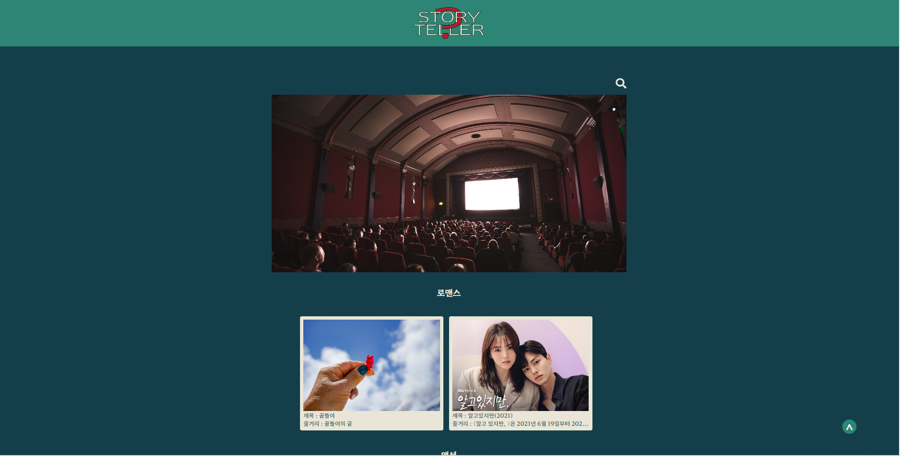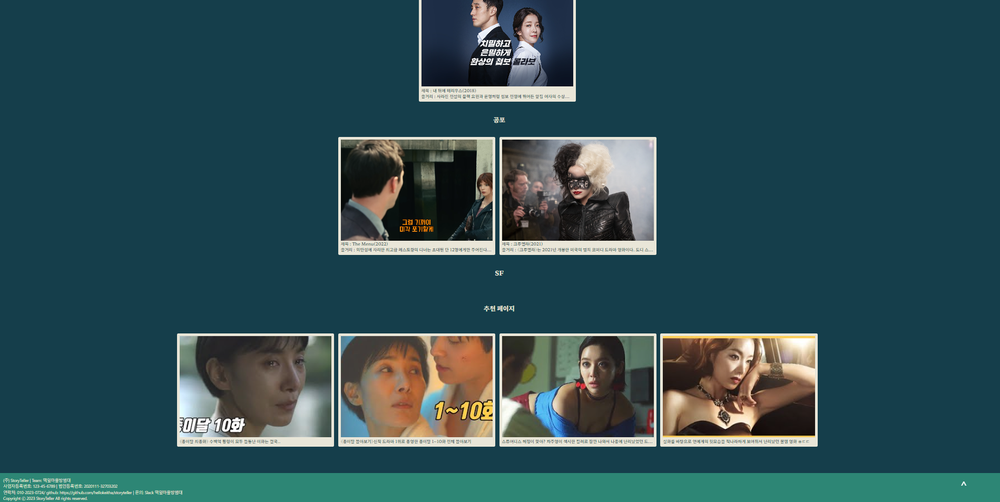  
  2. Search 페이지: 카테고리 별로 드라마를 확인할 수 있으며 결과가 없을 때 추천 목록이 뜹니다.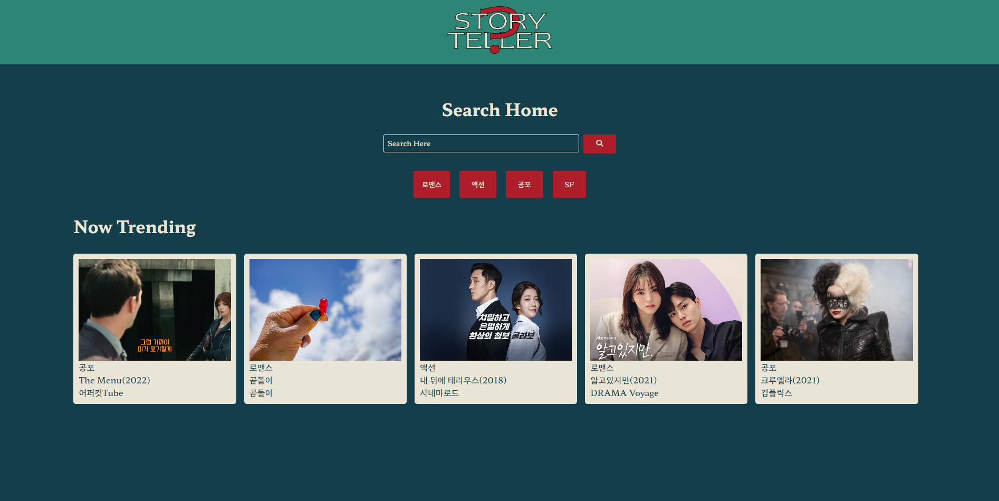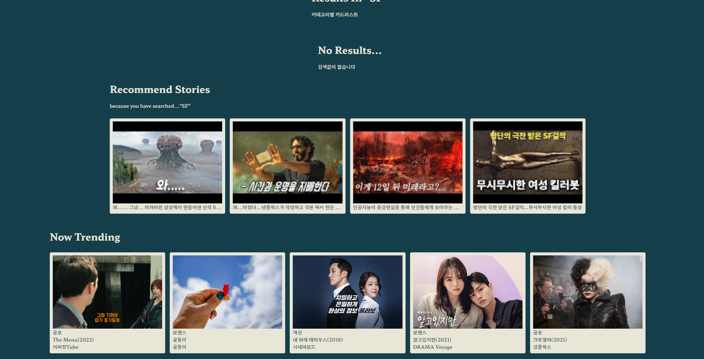 
  3. Detail 페이지: 카드를 누르면 드라마 세부 내용을 확인할 수 있습니다.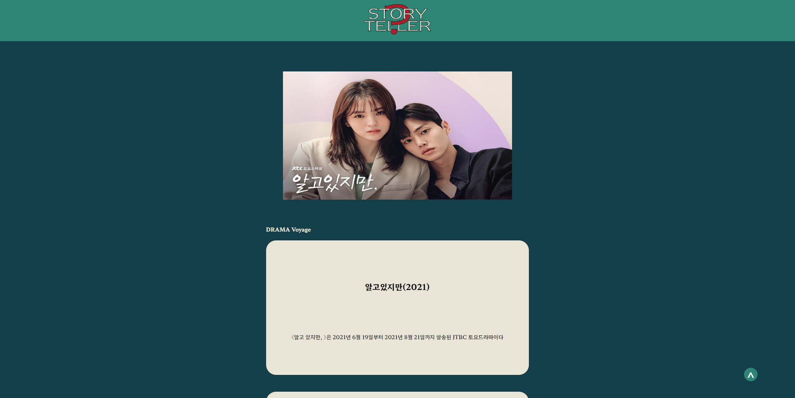 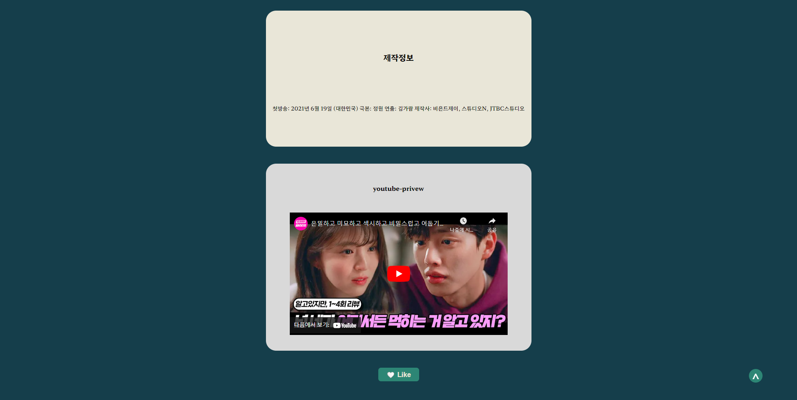 
  4. About 페이지: 페이지 소개 페이지입니다.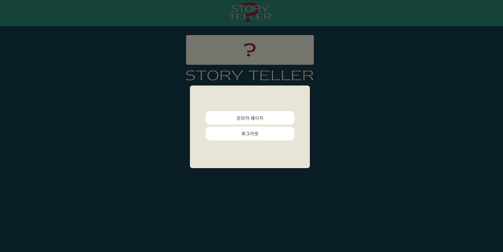 
  5. Admin 페이지: 글 목록 확인 및 작성이 가능합니다. 로그인을 해야 글 작성 및 수정이 가능합니다.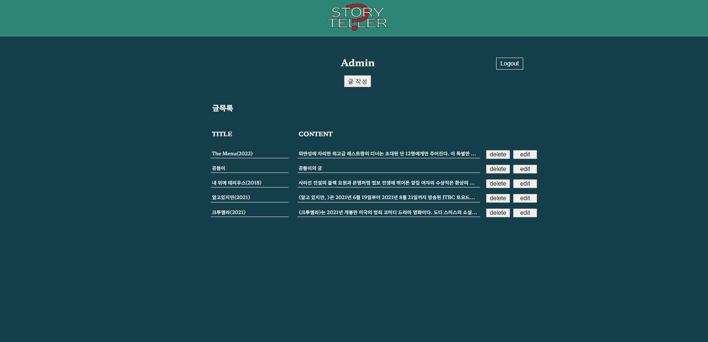 
  6. Write 페이지: 에디터가 글을 작성할 수 있는 페이지입니다.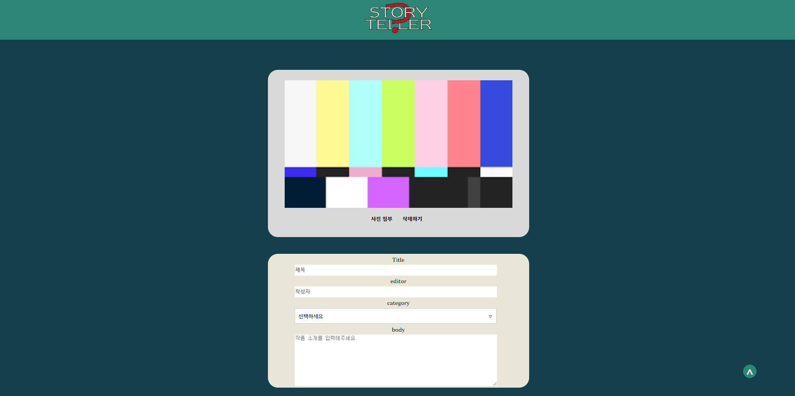 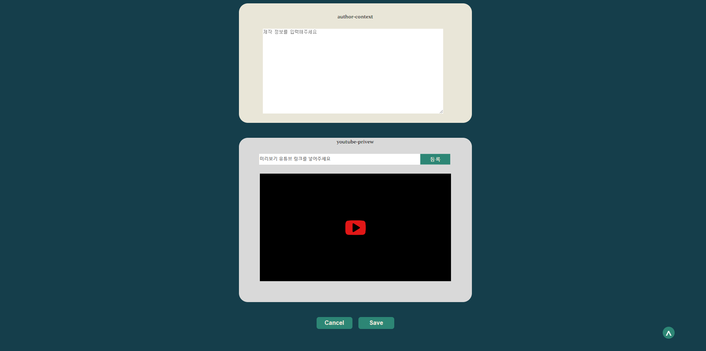 
  7. Edit 페이지: 드라마 별 내용을 수정할 수 있습니다. 수정 전 내용도 확인 가능합니다.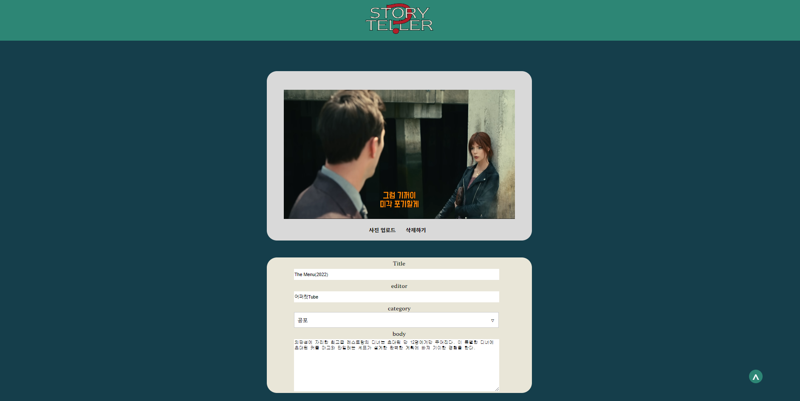 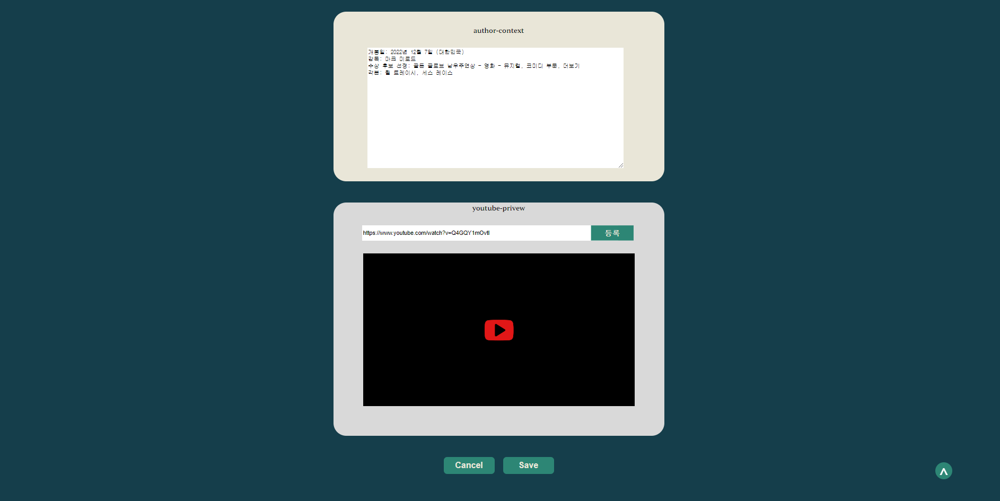
